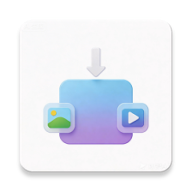

<div>
# MediaCompress
Kotlin Compose Architecture API
</div>
<div align="center">
  
</div>
## 🎯 项目简介
**MediaCompress** 是一款基于 Android 的高性能智能媒体压缩应用。
它实现了从 媒体选取 → 智能压缩 → 本地存储 → 结果展示 的完整闭环，支持图片和视频的全方位压缩优化，在保证画质的前提下，文件体积可减少 60%~80%+，并在各种网络环境下保持稳定、高效的响应速度。

## ✨ 核心功能与亮点

### 🖼️ 智能图像压缩引擎
- **多格式支持**：原格式保留 / JPEG / PNG / WebP，灵活选择
- **三层压缩机制**：Bitmap 采样 → 分辨率缩放 → 质量控制
  - 采样率智能计算，大图加载安全高效
  - 支持自定义图片宽高比例，范围 25%~100%
  - 质量等级可调（0-100），兼顾体积与画质平衡
- **EXIF 保护**：自动识别和维护图片旋转信息
- **批量压缩**：支持多张图片统一处理，并发优化

### 🎬 专业视频压缩方案
- **硬件加速编码**：基于 Android MediaCodec 的 H.264 编码器，高效且省电
- **FFmpeg 驱动**：集成 FFmpeg-Kit，支持复杂视频处理
- **自适应分辨率**：支持自定义缩放（如 1280x720），保持原宽高比或强制调整
- **灵活配置**：质量控制 + 分辨率缩放 + 可选音频移除

### ⚡ 现代化架构与流畅体验
- **Jetpack Compose + MVVM 架构**：响应式 UI，数据驱动
- **StateFlow 全局状态管理**：压缩中 / 完成 / 失败 / 重试，UI 实时反馈
- **Kotlin 协程**：全链路异步操作，主线程零阻塞
- **智能任务调度**：SupervisorJob 独立管理，单个任务失败不影响其他任务
- **流畅动画过渡**：Compose Animation API，页面切换自然顺滑

### 🧩 持久化与历史追踪
- **Room 本地数据库**：完整的压缩历史记录，支持查询与删除
- **自动计算统计**：文件大小 / 压缩率 / 存储空间节省统计
- **一键清空**：清理历史记录与本地压缩文件

### 📱 系统性优化与兼容性
- **全面的权限管理**：Android 13+ 媒体权限适配
- **安全的文件访问**：ContentResolver 读取，ExternalFilesDir 存储
- **大图加载安全**：Bitmap 采样 + OOM 防护机制
- **多屏幕适配**：Compose 自适应布局，完美兼容各尺寸设备
- **异常处理**：完整的错误恢复机制

### 🎨 用户友好的交互设计
- **五大功能模块**：
  - 📤 **主页**：媒体选取，参数配置
  - 🔄 **实时处理**：进度显示，动态反馈
  - ✅ **完成预览**：结果查看，文件对比
  - 📋 **历史管理**：记录查询，统计展示
  - ⚙️ **设置中心**：全局配置选项
- **底部导航**：清晰的模块切换
- **抽屉菜单**：快速访问设置与帮助

## 🧰 技术栈
| 类别 | 技术 |
|------|------|
| 语言 | Kotlin |
| 架构 | MVVM + Clean Architecture |
| UI 框架 | Jetpack Compose + Material3 |
| 异步编程 | Kotlin Coroutines + StateFlow + Flow |
| 本地数据 | Room Database + DAO |
| 图像处理 | Bitmap API + EXIF 处理 |
| 视频处理 | FFmpeg-Kit + Android MediaCodec |
| 图像加载 | Glide / Coil |
| 网络/序列化 | Gson |
| 导航 | Jetpack Navigation Compose |
| 构建工具 | Gradle + Kotlin DSL |
| 依赖管理 | libs.versions.toml （Version Catalog） |

## 📂 项目结构

```
MediaCompress/
├── app/
│   └── src/main/java/com/hailong/mediacompress/
│       ├── MainActivity.kt                    # 主 Activity，导航容器
│       ├── model/
│       │   └── MediaItem.kt                   # 媒体数据模型
│       ├── repository/
│       │   └── MediaRepository.kt             # 数据访问层，业务逻辑聚合
│       ├── viewmodel/
│       │   └── MediaViewModel.kt              # 视图模型，状态管理
│       ├── processor/
│       │   ├── ImageProcessor.kt              # 图片压缩处理器
│       │   └── VideoProcessor.kt              # 视频压缩处理器
│       ├── data/
│       │   └── AppDatabase.kt                 # Room 数据库配置
│       ├── utils/
│       │   └── MediaUtils.kt                  # 工具类
│       └── ui/
│           ├── screens/
│           │   ├── HomeScreen.kt              # 主页-媒体选取
│           │   ├── SettingsScreen.kt          # 设置页
│           │   ├── HistoryScreen.kt           # 历史记录页
│           │   └── CompletedScreen.kt         # 完成结果页
│           └── theme/
│               └── Theme.kt                   # 主题配置
│       
├── build.gradle
├── local.properties
└── README.md
```

## 🚀 快速开始

### 环境要求
- Android Studio Koala 或更高版本
- Android SDK 24+ (Android 7.0)
- Java/Kotlin 11+
- Gradle 8.0+

### 编译与运行
```bash
# 克隆项目
git clone https://github.com/your-repo/MediaCompress.git
cd MediaCompress

# 构建项目
./gradlew build

# 运行应用
./gradlew installDebug
```

### 验证编译
```bash
# 检查依赖完整性
./gradlew dependencies

# 运行单元测试
./gradlew test

# 打包发布版本
./gradlew assembleRelease
```

## 💡 核心算法与实现细节

### 图片压缩流程
```
原始图片 (URI)
    ↓
1. 采样率计算
   - 使用 BitmapFactory.Options.inJustDecodeBounds
   - 计算合适的 inSampleSize 降低分辨率
    ↓
2. EXIF 处理
   - 识别图片旋转角度
   - 自动应用 Matrix 变换
    ↓
3. 分辨率缩放
   - 根据用户选择的百分比调整宽高
   - 保持宽高比或自定义缩放
    ↓
4. 质量压缩
   - 使用 bitmap.compress()
   - 支持 JPEG (质量 0-100)
   - 支持 PNG (无损)
   - 支持 WebP (LOSSY/LOSSLESS)
    ↓
5. 保存输出
   - 写入到外部存储
   - 记录到 Room 数据库
    → 压缩完成
```

### 视频压缩流程
```
原始视频 (URI)
    ↓
1. 路径获取 (ContentResolver → 真实文件路径)
    ↓
2. FFmpeg 命令组装
   - 使用 H.264 硬件编码器 (h264_mediacodec)
   - 可选：分辨率缩放 scale=1280:720
   - 可选：移除音频
    ↓
3. 异步执行
   - FFmpegKit.executeAsync()
   - 实时日志回调
   - 统计信息追踪
    ↓
4. 完成处理
   - 生成压缩文件
   - 更新数据库状态
   - UI 实时反馈进度
    → 压缩完成
```

### 状态管理流程
```
ViewModel (StateFlow)
    ↓
Repository (Flow + Coroutines)
    ↓
Processor (ImageProcessor / VideoProcessor)
    ↓
Database (Room)
    ↓
UI (Compose) ← 实时订阅状态变化
```

## 📊 性能指标

| 指标 | 目标值 |
|------|--------|
| 图片压缩率 | 60%-80% |
| 单张图片耗时 | <500ms |
| 视频端到端耗时 | 依赖源视频大小 |
| 内存占用峰值 | <200MB |
| App 启动时间 | <2s |
| 数据库查询 | <50ms |

## 🔐 权限声明

| 权限 | 用途 |
|------|------|
| `READ_EXTERNAL_STORAGE` | 读取用户媒体文件 (API <33) |
| `WRITE_EXTERNAL_STORAGE` | 写入压缩结果 (API <29) |
| `READ_MEDIA_IMAGES` | 读取图片权限 (API ≥13) |
| `READ_MEDIA_VIDEO` | 读取视频权限 (API ≥13) |

## 🐛 已知问题与限制

1. **视频兼容性**：某些特殊编码格式可能不被 H.264 MediaCodec 支持
2. **大文件处理**：超大视频文件可能面临内存或时间压力
3. **离线模式**：暂不支持离线处理队列持久化

## 🎯 后续优化方向

- [ ] 支持批量视频压缩队列
- [ ] 添加 AI 智能参数推荐
- [ ] 支持云端备份与同步
- [ ] 支持高级编码参数调优（B帧、码率控制等）
- [ ] 集成 Android 12+ 的 Per-app Language 支持
- [ ] 性能监测与崩溃日志上报

## 📄 许可证
MIT License - 详见 LICENSE 文件

## 👤 作者
**hailong** - 独立开发者

---

**最后更新**：2026年3月  
**项目版本**：v1.0

快来体验智能媒体压缩的力量吧！🚀
